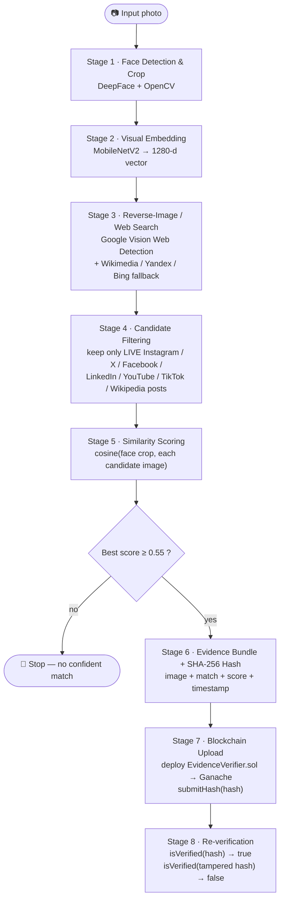

\documentclass[10pt,a4paper]{article}

\usepackage[margin=0.65in]{geometry}
\usepackage{titlesec}
\usepackage{hyperref}
\usepackage{enumitem}

\hypersetup{
    colorlinks=true,
    linkcolor=blue,
    urlcolor=blue
}

\titleformat{\section}
  {\normalsize\bfseries}
  {}
  {0pt}
  {}

\setlength{\parindent}{0pt}
\setlength{\parskip}{3pt}

\begin{document}


<!-- TABLE OF CONTENTS -->
<details>
  <summary>Table of Contents</summary>
  <ol>
    <li><a href="#about-the-project">About The Project</a>
      <ul><li><a href="#built-with">Built With</a></li></ul>
    </li>
    <li><a href="#pipeline-overview">Pipeline Overview</a>
      <ul>
        <li><a href="#stage-by-stage-breakdown">Stage-by-stage breakdown</a></li>
      </ul>
    </li>
    <li><a href="#getting-started">Getting Started</a>
      <ul>
        <li><a href="#prerequisites">Prerequisites</a></li>
        <li><a href="#installation">Installation</a></li>
      </ul>
    </li>
    <li><a href="#usage">Usage</a></li>
    <li><a href="#blockchain-used">Blockchain Used</a></li>
    <li><a href="#repository-structure">Repository Structure</a></li>
  
    <li><a href="#known-limitations">Known Limitations</a></li>
    <li><a href="#contributing">Contributing</a></li>
    <li><a href="#license">License</a></li>
    <li><a href="#contact">Contact</a></li>
    <li><a href="#acknowledgments">Acknowledgments</a></li>
  </ol>
</details>

<!-- ABOUT THE PROJECT -->
## About The Project

**FaceTrace** is an end‑to‑end proof‑of‑concept built for HH Goa 2026 Task 3. Given a single face photo, it:

1. detects and crops the face,
2. genuinely searches the live web for a real social‑media post whose image matches those pixels , and
3. writes a tamper‑evident fingerprint of that discovery to a blockchain, so anyone can re‑verify the finding later without trusting a database.

The point isn't just "find a photo" — it's proving that a specific piece of web evidence was discovered at a specific time and hasn't been altered since, using cryptographic hashing plus an on‑chain record instead of a screenshot anyone could edit.

<p align="right">(<a href="#readme-top">back to top</a>)</p>

### Built With

* [![Python][Python-badge]][Python-url]
* [![TensorFlow][TensorFlow-badge]][TensorFlow-url]
* [![OpenCV][OpenCV-badge]][OpenCV-url]
* [![Solidity][Solidity-badge]][Solidity-url]
* [![Web3.py][Web3py-badge]][Web3py-url]
* [![Ganache][Ganache-badge]][Ganache-url]
* [![Google Cloud Vision][GCP-badge]][GCP-url]

<p align="right">(<a href="#readme-top">back to top</a>)</p>

<!-- PIPELINE OVERVIEW -->
## Pipeline Overview



### Stage-by-stage breakdown

| # | Stage | Module | What happens | Tech |
|---|-------|--------|---------------|------|
| 1 | **Face Detection & Crop** | `face_id/crop_face.py` | Detects every face in the source photo, keeps the largest one, pads the box so hair/chin stay in frame, softens the background, and saves a clean crop. | DeepFace (OpenCV detector) |
| 2 | **Visual Embedding** | `face_id/visual_embed.py` | Converts the crop (and the full input image) into a 1280‑dimensional feature vector from pixels alone — no OCR, no names read. | MobileNetV2 (ImageNet weights) |
| 3 | **Reverse-Image / Web Search** | `search/web_search.py` | Sends the crop to Google Cloud Vision's **Web Detection** API to find live pages/images with matching pixels. If that comes back empty, it falls back to a Wikimedia Commons hash lookup, then Yandex and Bing visual search. This is a genuine live query every run — nothing is pre-picked. | Google Cloud Vision (primary) + Wikimedia / Yandex / Bing (fallback) |
| 4 | **Candidate Ranking & Filtering** | `search/web_search.py` (`_rank`, `_social_post_platform`, `_live_social_post`) | Scores each URL by platform (Instagram, X/Twitter, Facebook, LinkedIn, YouTube, TikTok, Wikipedia…) and match type, does a live HTTP check to confirm the post still exists, and keeps the strongest hit per platform. | Heuristic scoring + live HTTP check |
| 5 | **Similarity Scoring** | `face_id/similarity.py` | Downloads each surviving candidate image, embeds it with the same MobileNetV2 model, and ranks all candidates by cosine similarity against the face crop. | Cosine similarity |
| 6 | **Evidence Bundle & Hashing** | `evidence/hasher.py` | Packages the source image, crop, matched URL(s), platform, similarity score, and a Unix timestamp into one canonical JSON record, then SHA‑256 hashes it. | SHA‑256 |
| 7 | **Blockchain Upload** | `chain/client.py` + `chain/contract.sol` | Compiles and deploys the `EvidenceVerifier` Solidity contract to a local Ganache chain, then calls `submitHash()` to write the evidence hash on‑chain. | Solidity 0.8 · web3.py · py‑solc‑x · Ganache |
| 8 | **Re-verification** | `chain/client.py` (`is_verified`) | Calls `isVerified(hash)` to read the record straight back from the chain, then deliberately tampers with one field of the bundle, re‑hashes it, and shows that hash comes back `False` — proving the on‑chain record is tamper‑evident, not just stored. | On‑chain read call |

Run end‑to‑end, `demo.py` prints every one of these stages live, including the confidence score of the winning match and the tamper‑check result.

<p align="right">(<a href="#readme-top">back to top</a>)</p>

<!-- GETTING STARTED -->
## Getting Started

### Prerequisites

* **Python 3.10+** (the codebase uses `X | None` union type hints)
* **Node.js + npm** — to install Ganache
  ```sh
  npm install -g ganache
  ```
* **A Google Cloud project with the Vision API enabled** — needed for reverse‑image search (see Installation)

### Installation

1. Clone the repo
   ```sh
   git clone https://github.com/github_username/repo_name.git
   cd repo_name
   ```
2. *(Recommended)* create and activate a virtual environment
   ```sh
   python -m venv .venv
   source .venv/bin/activate      # Windows: .venv\Scripts\activate
   ```
3. Install Python dependencies
   ```sh
   pip install -r requirements.txt
   ```
4. Set up **Google Cloud Vision** credentials
   1. Create a project at [console.cloud.google.com](https://console.cloud.google.com)
   2. Enable the **Cloud Vision API**
   3. Create a service account → download its JSON key
   4. Point the app at it:
      ```sh
      export GOOGLE_APPLICATION_CREDENTIALS="/path/to/key.json"    # Windows (PowerShell): $env:GOOGLE_APPLICATION_CREDENTIALS="C:\path\to\key.json"
      ```
5. *(Optional)* Never commit your key — it's already covered by `.gitignore`.

<p align="right">(<a href="#readme-top">back to top</a>)</p>

<!-- USAGE EXAMPLES -->
## Usage

Run the full pipeline on a photo:

```sh
python demo.py path/to/photo.jpg
```

Add `--yes` to auto‑confirm the blockchain upload step (useful for a smooth screen recording):

```sh
python demo.py --yes path/to/photo.jpg
```

Ganache starts automatically on port `8545` if it isn't already running. To start it yourself:

```sh
ganache --host 127.0.0.1 --port 8545
# Windows PowerShell: if `ganache` is blocked by execution policy, use ganache.cmd instead
ganache.cmd --host 127.0.0.1 --port 8545
```

Sample console flow:

```
Stage 1: cropping the face from the input image...
Stage 2: MobileNetV2 embeddings for input image and cropped face...
Stage 3: searching the web for visually similar images (from the crop)...
Stage 4: cosine(cropped face, each web-search image)...
Best match: https://www.instagram.com/p/xxxxxxxxx/
cosine(crop, web image) = 0.812345  (threshold 0.55)
Stage 5: building and hashing evidence bundle...
Stage 6: uploading hash to blockchain...
Stage 7: re-verifying...
On-chain verification result: True
Tampered hash verification result (should be False): False
```

<p align="right">(<a href="#readme-top">back to top</a>)</p>

<!-- BLOCKCHAIN USED -->
## Blockchain Used

**Ganache** — a local, Ethereum‑compatible chain (started automatically by `chain/client.py`) running a small Solidity contract, `EvidenceVerifier`:

```solidity
function submitHash(bytes32 hash) public;          // writes hash + block.timestamp on-chain
function isVerified(bytes32 hash) public view returns (bool);
```

* Deployment and calls go through **web3.py**; the contract is compiled at runtime with **py‑solc‑x** (Solidity `0.8.0`).
* `submitHash` emits a `HashSubmitted(hash, timestamp)` event and stores the hash in a `mapping(bytes32 => bool)`.
* Re‑verification is a plain read call (`isVerified`) — no gas, no trust in the demo script required; anyone with the ABI and contract address can check it independently.
* **Swapping to a public testnet or mainnet** only requires changing `GANACHE_URL` in `chain/client.py` to a public RPC endpoint (e.g. Sepolia via Infura/Alchemy) and funding the deploying account — the contract and `submit_hash`/`is_verified` calls are unchanged.

<p align="right">(<a href="#readme-top">back to top</a>)</p>

<!-- REPOSITORY STRUCTURE -->
## Repository Structure

```
.
├── demo.py                    # runs the full 8-stage pipeline end to end
├── requirements.txt
├── face_id/
│   ├── crop_face.py           # Stage 1 — face detection + smart crop
│   ├── visual_embed.py        # Stage 2 — MobileNetV2 embeddings
│   ├── similarity.py          # Stage 5 — cosine similarity scoring
│   └── encode_face.py         # optional: Facenet512 identity-grade embeddings
├── search/
│   ├── web_search.py          # Stage 3 & 4 — reverse-image search + candidate ranking
│   └── person_profiles.py     # optional: Wikidata-based named-profile lookup
├── evidence/
│   └── hasher.py               # Stage 6 — evidence bundle + SHA-256 hash
└── chain/
    ├── contract.sol            # EvidenceVerifier smart contract
    └── client.py                # Stage 7 & 8 — deploy, submit, verify
```

<p align="right">(<a href="#readme-top">back to top</a>)</p>
<p align="right">(<a href="#readme-top">back to top</a>)</p>

<!-- KNOWN LIMITATIONS -->
## Known Limitations

* Reverse-image search only surfaces a match when the photo (or a near-duplicate) is **already public** and indexed by Google/Yandex/Bing/Wikimedia — brand-new or private photos won't match anything.
* The ranking score is **general-purpose visual similarity** (MobileNetV2 cosine similarity), not a dedicated face-recognition model — it isn't identity-grade on its own. `face_id/encode_face.py` (Facenet512) is included for a stricter same-person check but isn't wired into the default pipeline yet.
* Sites that block hotlinking or return non-image responses show `cosine_similarity: n/a` for that candidate and sink to the bottom of the ranking.
* **Ganache is ephemeral** — its state resets on restart. It's a demonstration chain, not persistent storage; point `chain/client.py` at a public testnet for durability.
* Google Cloud Vision has request quotas/cost; the Yandex and Bing fallbacks are best-effort HTML scrapes and may break if those sites change their markup.
* On Windows, PowerShell can block `ganache.ps1` via execution policy — the client automatically prefers `ganache.cmd`.

<p align="right">(<a href="#readme-top">back to top</a>)</p>

<!-- CONTRIBUTING -->
## Contributing

Contributions make the open-source community amazing. Any contributions are **greatly appreciated**.

If you have a suggestion, fork the repo and open a pull request. You can also open an issue with the tag "enhancement". Don't forget to give the project a star! 🌟

1. Fork the Project
2. Create your Feature Branch (`git checkout -b feature/AmazingFeature`)
3. Commit your Changes (`git commit -m 'Add some AmazingFeature'`)
4. Push to the Branch (`git push origin feature/AmazingFeature`)
5. Open a Pull Request

<p align="right">(<a href="#readme-top">back to top</a>)</p>

<!-- LICENSE -->
## License

Distributed under the MIT License. See `LICENSE.txt` for more information.

<p align="right">(<a href="#readme-top">back to top</a>)</p>

<!-- CONTACT -->
## Contact
**Virendra Badgotya:**
[](https://www.linkedin.com/in/virendra-badgotya-ai/)
[](mailto:da26m027@smail.iitm.ac.in)

**Aditya Suwalka:**
[](https://www.linkedin.com/in/aditya-suwalka/)
[](mailto:adityasuwalka12@gmail.com)

**VL Praneeth:**
[](https://www.linkedin.com/in/v-l-praneeth-69a071246)
[](mailto:da26m026@smail.iitm.ac.in)

<p align="right">(<a href="#readme-top">back to top</a>)</p>

<!-- ACKNOWLEDGMENTS -->
## Acknowledgments

* [DeepFace](https://github.com/serengil/deepface)
* [Google Cloud Vision API](https://cloud.google.com/vision)
* [Ganache](https://trufflesuite.com/ganache/)
* [web3.py](https://web3py.readthedocs.io/)
* [py-solc-x](https://github.com/ApeWorX/py-solc-x)
* [Keras Applications — MobileNetV2](https://keras.io/api/applications/mobilenet/)
* [Wikimedia Commons API](https://commons.wikimedia.org/w/api.php)
* [Best-README-Template](https://github.com/othneildrew/Best-README-Template)
* [Shields.io](https://shields.io)
* [Choose an Open Source License](https://choosealicense.com)

<p align="right">(<a href="#readme-top">back to top</a>)</p>

<!-- MARKDOWN LINKS & IMAGES -->
[contributors-shield]: https://img.shields.io/github/contributors/github_username/repo_name.svg?style=for-the-badge
[contributors-url]: https://github.com/github_username/repo_name/graphs/contributors
[forks-shield]: https://img.shields.io/github/forks/github_username/repo_name.svg?style=for-the-badge
[forks-url]: https://github.com/github_username/repo_name/network/members
[stars-shield]: https://img.shields.io/github/stars/github_username/repo_name.svg?style=for-the-badge
[stars-url]: https://github.com/github_username/repo_name/stargazers
[issues-shield]: https://img.shields.io/github/issues/github_username/repo_name.svg?style=for-the-badge
[issues-url]: https://github.com/github_username/repo_name/issues
[license-shield]: https://img.shields.io/github/license/github_username/repo_name.svg?style=for-the-badge
[license-url]: https://github.com/github_username/repo_name/blob/main/LICENSE.txt

[Python-badge]: https://img.shields.io/badge/Python-3.10+-3776AB?style=for-the-badge&logo=python&logoColor=white
[Python-url]: https://www.python.org/
[TensorFlow-badge]: https://img.shields.io/badge/TensorFlow%2FKeras-MobileNetV2-FF6F00?style=for-the-badge&logo=tensorflow&logoColor=white
[TensorFlow-url]: https://www.tensorflow.org/
[OpenCV-badge]: https://img.shields.io/badge/OpenCV-DeepFace-5C3EE8?style=for-the-badge&logo=opencv&logoColor=white
[OpenCV-url]: https://opencv.org/
[Solidity-badge]: https://img.shields.io/badge/Solidity-0.8.0-363636?style=for-the-badge&logo=solidity&logoColor=white
[Solidity-url]: https://soliditylang.org/
[Web3py-badge]: https://img.shields.io/badge/web3.py-Ethereum-F16822?style=for-the-badge&logo=ethereum&logoColor=white
[Web3py-url]: https://web3py.readthedocs.io/
[Ganache-badge]: https://img.shields.io/badge/Ganache-Local%20Chain-E4A663?style=for-the-badge&logo=ethereum&logoColor=white
[Ganache-url]: https://trufflesuite.com/ganache/
[GCP-badge]: https://img.shields.io/badge/Google%20Cloud-Vision%20API-4285F4?style=for-the-badge&logo=googlecloud&logoColor=white
[GCP-url]: https://cloud.google.com/vision
